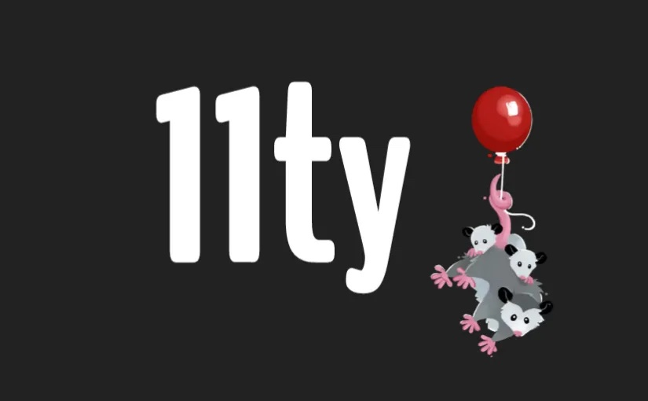

I forked [11ty/eleventy-base-blog](https://github.com/11ty/eleventy-base-blog) and
was super happy.



Then I realized when I share my blog posts in Discord or Mastodon (etc.),
previews weren't working. My pretty images weren't previewing. Sad.

Those work via the [Open Graph protocol](https://ogp.me/), which is `og:image` and
other tags in your `<html><head>`.

I tried adding those tags, and got sad when I hit a bunch of problems. So I went to the
[11ty Discord](https://www.11ty.dev/blog/discord/) and asked what gives?

And they said eleventy-base-blog has a bug. The new super fancy image stuff doesn't
play well with a per-post `og:image`. Sad.
But it's a known issue and there's even a solution! Yay!

So I implemented it, and it worked for me! Yay!

Here's what I did, stealing [Seramis' code](https://github.com/11ty/eleventy-img/issues/278#issuecomment-2609486605):

## eleventy.json.cfg

I added this line at the end of `function(eleventyConfig)`:

```js
eleventyConfig.addFilter("contentImgUrlFilter", contentImgUrlFilter);
```

Where'd that filter come from? It's new. We add it to the bottom of that same file:

```js
// Author: Seramis
// https://github.com/11ty/eleventy-img/issues/278
import path from 'node:path';
import Image from '@11ty/eleventy-img';
async function contentImgUrlFilter(src) {
  const inputDir = path.dirname(this.page.inputPath);
  const imagePath = path.resolve(inputDir, src);
  const outputDir = path.dirname(this.page.outputPath);
  const urlPath = this.page.url;

  const stats = await Image(imagePath, {
    widths: [1200], // Width for Open Graph image
    formats: ["jpg", "png"],
    outputDir: outputDir, // Output directory
    urlPath: urlPath, // Public URL path
    filenameFormat: function (hash, src, width, format) {
        return `${hash}-${width}.${format}`;
    },
  });
  return stats.jpeg[0].url; // Return the URL of the processed image
}
```

Those import commands should really be up top next to all the other ones. 🙂
I put 'em down there to be more obvious that I added them for my future merges of upstream/main. 🤷‍♂️ 

So now we have a new Filter. Neat. How do we use it? Like this:

## _includes/layouts/base.njk

I didn't have any `og:*` meta tags, so I added all of 'em. Sort of:

```html
  <head> ...
    <!-- <meta property="og:url" content="TODO" /> -->
    <!-- <meta property="og:logo" content="TODO" /> -->
    <meta property="og:type" content="website" />
    <meta property="og:title" content="{{ title }}" />
    <meta property="og:description" content="{{ description or metadata.description }}" />
    
        <meta property="og:image" content="{{ image | contentImgUrlFilter | absoluteUrl(metadata.url) }}" />
    
```

You can use [OrcaScan](https://orcascan.com/tools/open-graph-validator?url=https%3A%2F%2Fnotes.jays.net%2Fblog%2F11ty%2F) to check if it's working.

Where does `image` come from? From each of your blog posts. Like this:

## content/blog/11ty.md

```yaml
---
title: "11ty"
description: "Various tricks I've stumbled into."
date: 2025-02-11
image: 11ty.jpeg
---

11ty is cool!
```

And yay! It works!? All done! Now my blog posts preview on Discord, etc.
with my images. 🙂 Thanks Seramis! And thank you to cassey in 11ty Discord
for [all their help](https://discord.com/channels/741017160297611315/1335247804653899906) too!
