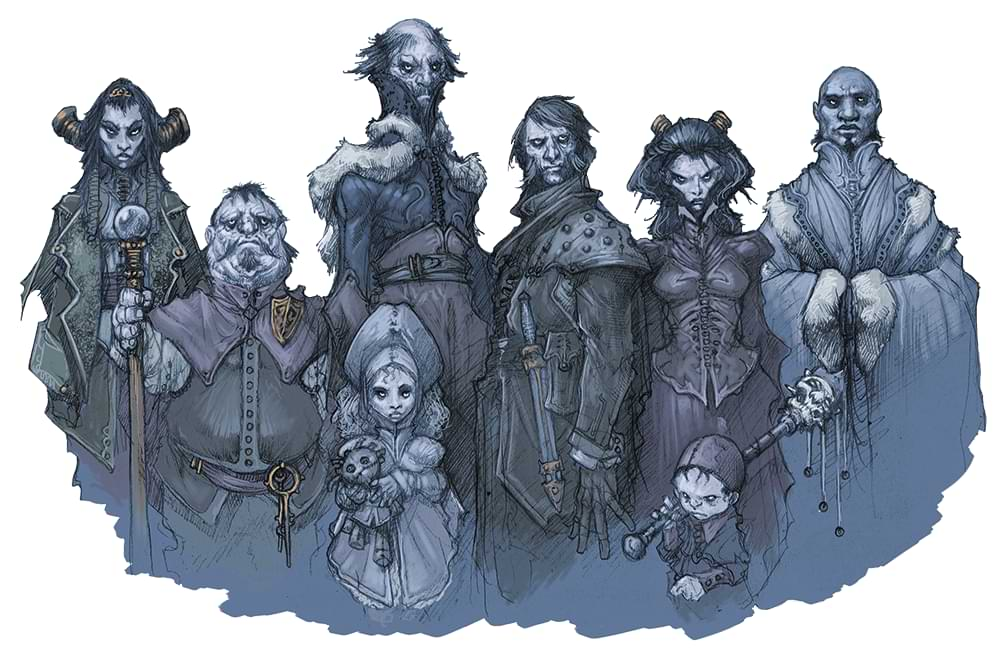

*[ Written by our DM, not Jay. ]*

**DISCLAIMER:** 
I'm doing this entirely from memory, so there's a good chance I'll miss stuff.
If I spell anything wrong, misstate a detail of the adventure, or anything
else, let me know. This is intended as a tool to be referenced later when we
have forgotten all of this and I want it to be as accurate as possible.

## CH. 1 - DEATH HOUSE

We entered the scene in a quaint little tavern on the outskirts of a quaint
little village. Our heroes had settled here for the evening after some time
adventuring together. Indigo, Willam, and Musu have recently been joined by
Sabine—a tall, serious paladin of Tyr who never takes her armor off and who
claims to have been raised by a cult in a walled monastery—and have welcomed
her into their little cadre. Indigo describes himself as a "dirty hippie" with
a penchant for pipeweed, which he and his twenty siblings grow on their family
farm. He is a staunch defender of nature and has given hints that this may have
caused him some trouble in the past. Willam has seen many things in his time.
He served as a wartime medic for his homeland in his younger days, but his side
was defeated and he returned home to find that his family had been slaughtered,
his home burnt. He seeks now only to heal people in need where he can. Musu
is a warrior. More on that later.

As our heroes relaxed and enjoyed their evening mead, they were approached by
an olive skinned man with long curly black hair and an excessive amount of
jewelry. He wore vibrant yellow robes with intricate crimson filigree and
carried a carved elderwood cane, studded with several gemstones on the head. He
introduced himself as Grigori (That was his name from the beginning. If you
remember otherwise, you are mistaken 😅) and asked for your assistance. He
said that he was a merchant and that two of his caravans had been sent to the
valley of Barovia to attempt to open trade and neither had returned. It had
been several months at that point and he was worried. You all agreed to
investigate and set out the next day at dawn towards the forest just outside of
town. 

As you walked through the forest, you were slowly surrounded by a thick ominous
cloud of fog, and a creeping darkness that followed you all the way into the
valley and ushered you towards the small village of Barovia, nestled in a
clearing in the woods. As you entered the village, the apparitions of two
scared children appeared and asked for your help with a monster in the basement
of their house. You entered the Durst manor and began to explore.

You discovered a well maintained, richly decorated, but strangely empty manor.
As you made your way through you had several encounters, including with a
spectre. You later discovered this was the spirit of the nanny to the Durst
children and the mother of Gustav's youngest child, Walter. She was murdered by
Gustav's wife Elizabeth as part of a series of cult sacrifices which culminated
in the sacrifice of baby Walter. This sacrifice appeased the dark power that
their cult worshipped and he awakened a great beast, Lorghoth the decayer,
which was made of refuse and the remains of the cult's sacrifices. The beast
hungered and eventually every member of the cult was sacrificed to appease it,
and in a final desperate act, Gustav killed his wife Elizabeth and then hanged
himself. In his madness, he forgot that he had locked his two elder children in
their room—for their safety—and they tragically starved to death.

The party made its way into the depths of the cellar where the cult had been
housed, fighting off many creatures, including the corpses of Gustav and
Elizabeth Durst, and collecting several items, including a mysterious black
crystal orb. Finally our heroes descended to the lowest level of the cellar
where the beast slept. They were called to sacrifice one individual and when
they refused, the beast attacked. Willam was engulfed by the monster and as the
rest of the team tried to find some way of destroying it from the outside,
Willam was able to locate the small body of Walter Durst still contained at its
heart. He said a prayer and a burst of radiant energy shot from his
outstretched hand and destroyed the tiny corpse. Lorghoth the Decayer was
vanquished and the party gathered the remains of the various Dursts and laid
them to rest. Except for the nanny. Whose body is still stuffed inside a trunk
in the attic.  You said your final goodbyes to Rosevald and Thornbolt Durst and
emerged from the house, seeing that the dense fog had receded.

Image via <a href="https://www.dndbeyond.com/posts/977-strahds-barovia-a-guide-to-d-ds-most-famous-horror">D&D Beyond</a> (spoilers)

## CH. 2 - THE VILLAGE OF BAROVIA

With the fog cleared away the party was able to see that the village was
nestled at the head of a valley created by Mount Baratok to the North and Mount
Ghakis to the Southwest. Just to the Northwest of the village sits an
impressive looking castle with high walls and several tall turrets with conical
roofs. The imposing structure sits atop a tall cliff face which descends about
1000 feet to the edge of town where a small chapel rests.

You all walked into the street where you encountered a sweet old lady with a
pastry cart who introduced herself as "Granny." You bought 6 of her dream
pastries and she directed you towards the Blood on the Vine tavern in the
middle of town where you could find several Vistani women to question. 

You entered the tavern and spoke with a middle aged Vistani woman named Alenka
while her two compatriots sat behind her whispering and giggling. Alenka
indicated that they no longer counted themselves among the Vistani and
preferred the ownership of the tavern over a life of wandering. When asked
about Grigori, the merchant who sent you into Barovia, Alenka told you that he
was a liar and a scoundrel. She had not heard of any trading caravans being
lost in Barovia.

After Alenka tired of your group, the young man sitting alone at the back of
the tavern introduced himself as Ismark the Lesser, the burgomeister of the
village. He told you that his father, the previous burgomeister, passed away
from apparent stress 3 days previously after a vicious siege on his house by
the minions of "The Devil Strahd." He asked for your assistance and you agreed
to accompany him to the burgomeister's mansion.

Before meeting him there, you briefly stopped into Bildrath's Mercantile where
a small balding man with thick glasses offered you a measly 13g for all of the
loot you had acquired in the Durst Manor. His prices seemed incredibly inflated
due to his shop being the only one in the village. His hulking assistant,
Parriwhimple made a brief appearance to see you all off, making it very clear
that Blidrath was not someone to be provoked.

Arriving at the burgomeister's mansion, you found Ismark waiting over the body
of his deceased father, Kolyan Indirovitch. He asked you to help him give his
father a proper burial as no one else in town would risk angering Strahd, to
which you all agreed. Ismark was also visited by a woman dubbed "Mad Mary" by
the townsfolk. She was distraught over the disappearance of her daughter,
Gertruda, ten days ago. Apparently Gertruda ran away into the woods and hasn't
been seen since. After reassuring Mary that you would all try to help find her
daughter and ushering her out, Ismark indicated to you all that there was very
little chance of helping the girl. She was very likely, he said, either dead or
under the control of Strahd, who occasionally would take a consort for his own
pleasure.

You all decided to get some rest for the night and to bury Kolyan in the
morning. You each ate one dream pastry before bed and slept soundly through the
night. Indigo and Willam experienced vibrant dreams of happy times, while
Sabine experienced a peaceful solitude that she had not felt in years. Waking
up the next morning was less pleasant as you were all brought back to the
dreary reality of the world you had entered. Despite the delicious breakfast of
burgers made by the "burger-master", you all started the day wishing just a
little bit that you were back in your dreams.

After breakfast you set out with the casket of Ismark's father and made the
short journey through town to the small chapel on the hill. Upon arriving you
encountered a haggard and confused priest, Father Donavitch. He was engrossed
in prayer and when the party finally got his attention, it was clear that he
was not entirely there. He was distraught over the "loss" of his son, but as he
talked you could hear the screams from below you of a young man pleading to be
let out and fed. After interrogating him and Ismark, you discovered that Doru,
the priest's son was lured to Strahd almost 10 years previously and turned into
one of his consorts. When Doru returned, his father, seeing that he had been
changed by Strahd, trapped him in the basement and began praying to the
Morninglord for aid. Doru has been locked there ever since, never having his
hunger satiated, and father Donavitch has lost himself in his grief and
desperation, not realizing the amount of time that has passed.

After performing the funeral rites and burial for Ismark's father, you went
back to the chapel to try and help Doru. Sabine descended the stairs first and
attempted to assess the situation. Doru was desperately hungry to the point
that it was all he could think or talk about. He looked like he wanted to
escape, but the party was able to keep him contained in the basement and beat a
hasty retreat when it became clear there was nothing that could be done for the
young man right now. You left the chapel, promising father Donavitch that you
would find a way to help his son. Ismark, however, indicated that this was not
likely.

## CH. 2 - THE VILLAGE OF BAROVIA - PART 2

You all emerged from the small chapel around noon feeling quite dour. Sabine,
Indigo and Musu took a few deep breaths and each recovered in their
turn. Willem began to hyperventilate and as he tried to catch his breath, he
suddenly found himself eating a dream pastry. He immediately began to feel
better and joined the rest of the party, who were all eyeing him suspiciously.

You decided that you needed to gather more information from the Vistani at the
tavern and Musu volunteered to go in and act as the infiltrator, as he
was...away...the last time you visited. He quickly and inadvertently attracted
the attention of the three Vistana women, who were all looking over at him
while exchanging excited whispers. After finding out that you were looking for
information on Grigori, she “invited” you to buy her and the other girls a
drink in exchange for what they knew.

You found out from them that Grigori is a known associate of Strahd and the he
was probably promised some kind of reward for bringing the party to Barovia.
You also learn that the three women have been cast out of the Vistani
community, though you do not know why. (I don’t remember if they told you
anything else. Anyone remember?)

As the party waited just out of sight of the tavern, Granny wheeled her cart
past and you now noticed that it was adorned with a small windmill insignia.
You talked with Granny for a little bit and ascertained that she and her two
sisters live in a windmill to the west of the village - the same windmill granted
by the deed in your party’s possession. Granny seemed very distressed when
presented with this information, thinking that you were going to make her and
her sisters leave their home, but you reassured her that that would not happen.
Before leaving, she slipped Willem an extra dream pie (There was a reason, I
don’t remember it, but I know it happened).

After leaving you, Granny went to the house you saw her visit yesterday and the
man came out looking almost frantic. Granny gave him his dream pastries,
seemingly collecting no payment, and went off down the street. When you
investigated the house, you were able to see through the window into a one room
cottage, neither filthy nor clean, where the man you had just seen was lying
asleep in the bed. On the far wall you noticed a small pair of overalls - a
child’s overalls - hanging by the back door. You attempted several times to wake
the man, all to no avail. You left without investigating further.

After this,
you went to see Mad Mary in her secluded manor, just up the road from the
Burgomaster’s mansion. Mary greeted you enthusiastically and welcomed your
assistance in finding her daughter. She allowed you into her house and led you
up the stairs and down a narrow hallway to a locked door at the very end. Her
daughter, Gertruda’s, bedroom was kept in pristine condition for the most part.
As you all searched the room, you found that there were markings on the stone
sill just outside her garden window that looked similar to some of the claw
marks you saw at Ismark’s mansion. You also discovered a small drop of blood on
the carpet right at the head of the bed that Mary dismissed as having come from
a nose bleed. As the group pushed her on this, Mary became more and more
distressed until she finally forced you all out.

Emerging onto the street once more, you all decided there was nothing more to
be done here and so you opted to move out of town in search of the Vistani camp
to the West of the village. You had walked about an hour towards the ever
growing line of trees when you came to the river that you had followed into the
valley. Indigo smelled a horrible stench as you neared the bridge that crossed
over and he went to investigate. About 50 feet from the bridge on the near side
of the river was the mangled, partially decomposed body of a young man. Tied up
just 10 feet away was a small rowboat. You searched the body and discovered a
note written by Kolyan Indirovich asking for aid - from whom, you do not know. It
appears that this young man was about to set out down the river to the West.

Deciding to avoid crossing the bridge, you instead opted to use the small
rowboat to travel downstream. You traveled several hours this way, passing into
the dark forest with its towering conifers. As nighttime approached, you came
across a place where the river seemed to converge with a path along the hill to
the south. You all decided to find camp here.

Musu and Indigo took the first watch while Sabine and Willem slept. Indigo
sensed the sounds of his howling brethren change about an hour after darkness
fell and knew they were coming for the party. He and Musu roused Sabine and
attempted to wake Willem, to no avail. The rest of the party hoisted Willem
into a nearby tree, high enough to be safe from the wolves, and lashed him
there.

As you finished securing Willem, six wolves emerged from the darkness
and attacked. Indigo attempted to talk them down, but they did not respond to
his overtures. After a quick fight, four wolves were down and the other two
retreated as a dark shadow coalesced in the clearing by the campfire. Strahd
von Zarovich greeted the party, welcoming them to Barovia. He apologized for
his wolves and told the party they would not be a problem tonight.

The party noticed a figure stooping behind Strahd in the darkness and
recognized it as Duro, the poor wretch from the chapel cellar. His face and
shirt were covered in dark blood and when questioned, he hid behind his master
who stated that he couldn’t be blamed for what he was driven in his hunger to
do. After extending to the party an invitation to visit him in his castle,
Ravenloft, he bid the party farewell and they melted into a swarm of bats (I
know I said just one, but this makes more sense) and flew away.

