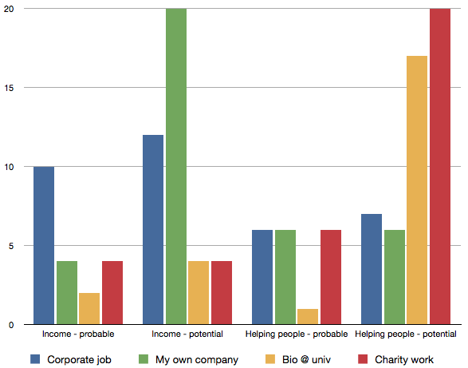

For my current goals see my [resume](/blog/resume) I guess?

Reading "circa 2000" now I laugh. That was ~shortly before I
realized I didn't want my boss' job. My boss' job sucked. I wanted
to build things and I was already at the pinnacle of building
at that org. Everything "above me" was people management: Telling
people to build, not building.
Not mastering a trade/craft.
I didn't, and don't, want to sit in meetings all day every day.

## circa 2022

12 years later, nothing has changed. The same questions are still
rattling around in my head.

## circa 2010

Motivators: Mapping my Brain

I was trying to noodle through what I wanted to do with
my working life and probable / potential incomes and helping people.

(Original 2010 post [on blogspot.com](https://headrattle.blogspot.com/2010/06/motivators-mapping-my-brain.html).)

## circa 2000

I have to admit I'm feeling more fulfilled now than I have been
since my early college days. For me happiness lies in feeling that
I'm getting the chance to prove myself in the areas I have skills in.
Since I've spent the last 5+ years in the Information Technology
business, my current top-priority life challenge is to prove to myself
(and to anyone else who cares to watch) that
I'm more than just a "wiz-kid" at a few computer gizmos
here or there; that I have real leadership potential and can effectively
organize and maintain a scope of technical resource beyond my own
meager 40-60 hours of weekly manpower.

If I can thrive in this environment for 3-5 years it's off to some
suit-and-tie VP position on my way to retiring as CIO somewhere.
Things are looking pretty good. Wish me luck.

Statement of goals in [jays.net in 2000](http://jays.net/archives/2000/retired2/oldindex.html).

## circa 1998

Statement of goals in [jays.net in 1998](http://jays.net/archives/1998/retired/oldindex.html).
