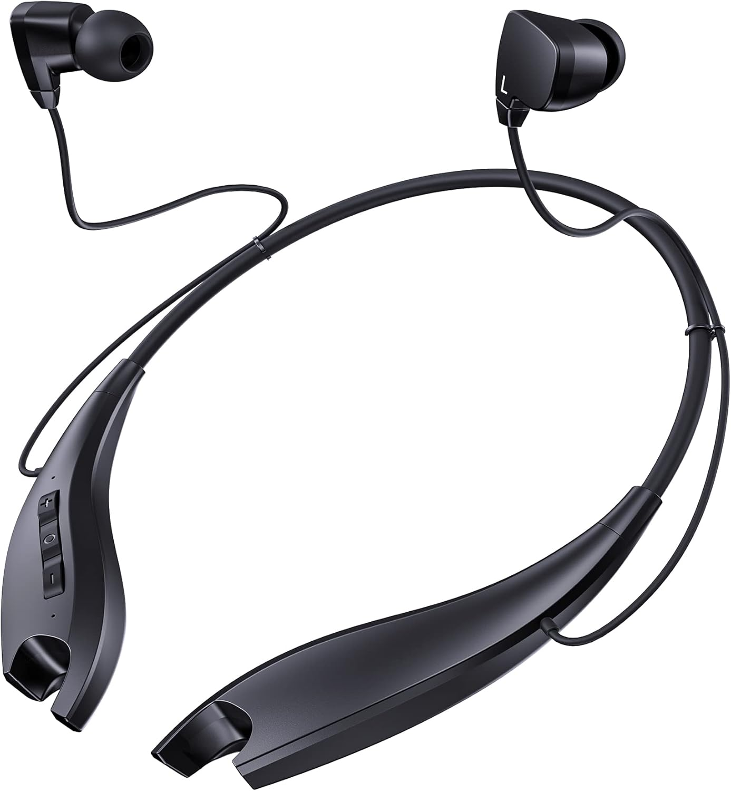

## For daily, exercise use

Nov 2024 I wrote:

In March 2016, the best headsets humanity ever made were available: MPOW Jaws:

* wired, around neck so I don't lose em.
* they don't fall off fat necks 🇺🇸
* great audio, mic quality
* great battery life (18 hours of play time?), fast charging
* physical power switch (instant on/off!)
* physical FF/REW buttons
* physical volume up/down buttons
* $20

For 8.5 years I used those damn things for hours every day. Best money I ever spent.

Unfortunately, MPOW Jaws Gen 5 eliminated all the buttons except 3. Now FF/REW
takes longer. Power on/off takes a lot longer. $30.

AFAICT, [these generic rip-offs of MPOW Jaws](https://www.amazon.com/dp/B09JYJ6JKH)
are the best headphones made today,
worse than they used to be, but functional: Amazon doesn't sell the MPOW
originals anymore? (Or maybe MPOW was never the original, maybe those were
ripoffs too?)

Photo of Gen 5, missing those buttons 😔

I am jealous that AirPods merge left + right channels into a single channel if
only using one. That is cool. My $30 headphones don’t do that. 🙂

## For noise cancellation

Aug 2025 I wrote:

I used noise cancelling headphones for the first time recently OMA -> ATL -> GCM and back and now I'm weak: I can't imagine flying without them again. I was actually upset when not wearing them.

Brother reports these work just as good as others that are 3-4X more expensive.
I paid $87 in March 2025:
[Sony WH-CH720N](https://amzn.to/4ghxoOs)

## Professional

Feb 2025 I wrote:

Me: Wow! Those gamer announcer nerds sound great! I should buy one of those headsets for my work calls. Excellent noise cancellation, even in loud rooms!

[@skatmaker](https://flyovercountry.social/@skatmaker@mstdn.social): they cost $550.
[Sennheiser HMD 27](https://www.sennheiser.com/en-us/catalog/products/microphones/hmd-27/hmd-27-700322)

Me: oh. Nevermind. I don't have gamer money.

