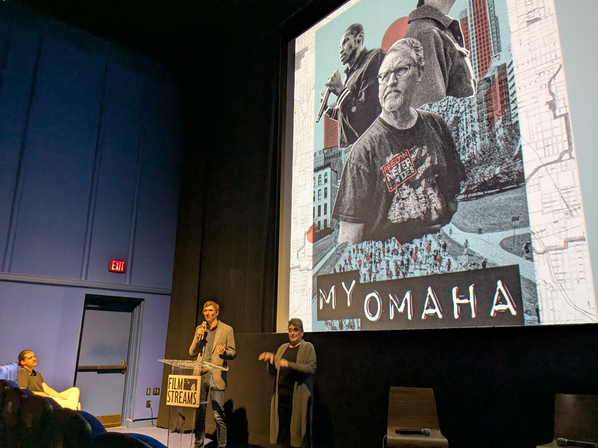

The filmmaker and Q&A at the sold out premier of "[My Omaha](https://www.myomahafilm.com/)" Oct 14 2025:

<!--  -->

"My Omaha" trailer:
<iframe width="560" height="315" src="https://www.youtube.com/embed/w8RV4X59WFg?si=NSWjwgcCow1tVDpc" title="YouTube video player" frameborder="0" allow="accelerometer; autoplay; clipboard-write; encrypted-media; gyroscope; picture-in-picture; web-share" referrerpolicy="strict-origin-when-cross-origin" allowfullscreen></iframe>

"My Omaha" made many references to another Omaha documentary: A Time For Burning (1966). And interviewed that filmmaker.

<iframe width="560" height="315" src="https://www.youtube.com/embed/q8PwM3TA094?si=BYJc05Nr306EWR9T" title="YouTube video player" frameborder="0" allow="accelerometer; autoplay; clipboard-write; encrypted-media; gyroscope; picture-in-picture; web-share" referrerpolicy="strict-origin-when-cross-origin" allowfullscreen></iframe>

"A Time For Burning" is not fucking around. No punches pulled. "My Omaha" is much softer in tone, even while much of the foundational content hasn't changed over those 59 years?

If you're confused about "white fragility," check out the last 10 minutes of "A Time For Burning."

Proposal: White Lutherans could meet (black) Lutherans in their homes.

Pastor fired.

Oof.

Mom was especially struck by the final song in the film. So I used [YTMP3](https://ytmp3.cx/) to rip the audio
of that YouTube video down and clip it for her:

<audio controls src="end of A Time For Burning (1966).m4a"></audio>

Mom wanted to buy that song, so I tried like hell to find it for her.
[In 2013](https://thelifemosaic.com/a-closer-look-7-a-time-for-burning/)
others were trying to find that song too and failed:
> I found the original song for the film written by Tom Paxton, arranged by B.G. Kornfeld,
> and sung by Ronnie Gilbert to be uplifting and I wish there was more information so I
> could find a copy to purchase.

[Discussion thread on Mastodon](https://flyovercountry.social/@deafferret/115377565314142653)
