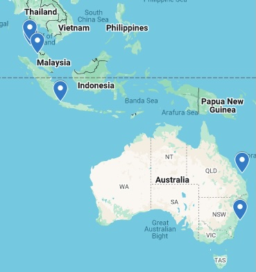
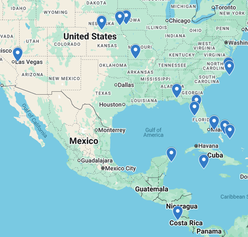

<nobr>

</nobr>

**Dive numbers** (dates) locations

* **150-153** (2024-12-22 through 26) Pacific Coast Dive Center, Playa Flamingo, Costa Rica.
* **134-149** (2024-03-27 through 31) [The Junk live-aboard](https://thejunk.com/):
  [Richelieu Rock](https://www.youtube.com/watch?v=NJg0zsLDKaA) 🤯 and others. Phuket, Thailand.
* **129-133** (2024-03-24 through 25) Sea Fun Divers, Phuket, Thailand.
* **110-128** (2022-06-11 through 16) [Avalon live-aboard](https://www.lostislandvoyages.com/Avalon),
  Nassau -> Exuma Cays, Bahamas.
* **104-109** (2020-08-06 through 8) [U-352](https://en.wikipedia.org/wiki/German_submarine_U-352#Dive_site)
  and others, Morehead City, North Carolina USA.
* **98-103** (2020-05-19 through Sep 18) Rock quarry, Atlantic, Iowa USA.
* **97** (2020-03-10) Rainbow River, Dunnellon, Florida USA.
* **94-96** (2019-06-11) Rock quarry, Atlantic, Iowa USA.
* **83-93** (2019-03-10 through Mar 15) Bimini, Bahamas.
* **77-82** (2017-10-07 through 2018-06-22) Rock quarry, Atlantic, Iowa USA.
* **70-76** (2017-09-15 through 16) Table Rock Lake, Branson, Missouri USA.
* **69** (?) Lake Zorinsky, Omaha, Nebraska USA.
* **67-68** (2017-05-27) Rock quarry, Atlantic, Iowa USA.
* **65-66** (2017-01-16) Vortex Springs, Ponce De Leon, Florida USA.
* **63-64** (2016-09-10) Rock quarry, Atlantic, Iowa USA.
* **57-62** (2016-01-29 through 31) Cozumel, Mexico.
* **53-56** (2015-08-20 through Oct 24) Rock quarry, Atlantic, Iowa USA.
* **37-52** (2015-05-30 through Jun 3) Blackbeards cruises, Exuma Cays, Bahamas.
* **35-36** (2014-10-10) Rock quarry, Atlantic, Iowa USA.
* **26-34** (2014-08-29 through Sep 3) USS Houston CA-30, Sunda Strait, Indonesia.
* **25** (2014-08-29) [HMAS Perth D29](https://en.wikipedia.org/wiki/HMAS_Perth_(D29)#Battle_of_Sunda_Strait), Sunda Strait, Indonesia.
* **21-24** (2014-08-26 through 28) [USS Houston CA-30](https://usshoustondive.com/divers/jay_hannah/), Sunda Strait, Indonesia.
* **20** (2014-08-20) Pulau Payar Marine Park, Malaysia.
* **17-19** (2014-07-19) Sand quarries, Sandy Channel State Recreation Area, Nebraska USA.
* **13-16** (2014-07-03 through 12) Rock quarry, Atlantic, Iowa USA.
* **11-12** (2014-06-18 through 19) Airplane Wing, Clearwater (~Tampa), Florida USA.
* **9-10** (2014-01-20) Lake Mead, Las Vegas, Nevada USA.
* **5-8** (2013-08-16 through 19) Vortex Springs, Ponce De Leon, Florida USA.
* **1-4** (2013-07-20 through 21) Rock quarry, Atlantic, Iowa USA.

Before open water certification:

* **0** (2007) Shark Dive Xtreme. Quick safety class then they throw you in. No fins. Overweighted,
  you walk around on the bottom. Manly Sea Life Sanctuary. Manly, Australia.
* **-1** (2007) "Resort certified" for scuba on Heron Island, Great Barrier Reef, Australia.
