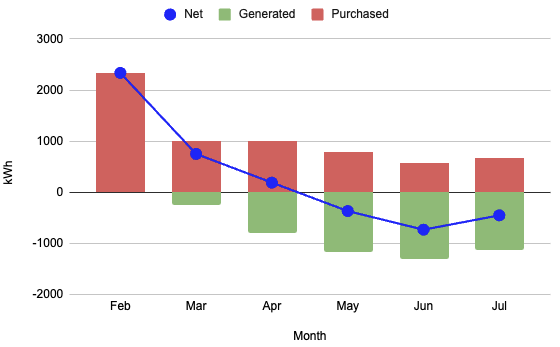

81 MW: Just west of Omaha:
[Platteview Solar Project](https://www.aes.com/energy-projects/platteview-solar-project-aes)

5 MW: Just north of my house,
[east of Fort Calhoun](https://pubdisplay.alsoenergy.com/kiosk/18014398509527082?dashkey=2a5669734965576e4a43513d3d&tag=4246267#xd_co_f=ODUyYTZmYzctNDcxNS00OGY5LTlmNjEtM2RlMWM1ODAyNGQz~)

12.6 kW: My house, theoretical max:
* 20 panels "south-facing"
* 12 panels "east-facing"

System installed late 2025 (new roof, panels, mains, plug for outside emergency generator).
Finally activated by OPPD Feb 12 2026.

Solar system designed, installed by: [New Energy, LLC](newenergyne.com).
They also replaced my roof because they also do roofing and it turned out I needed a new roof. 🤑

