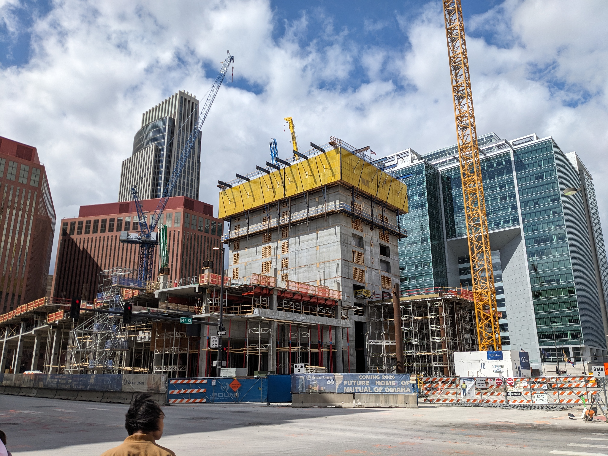

In Omaha, they demolished the old central library and are building the
[Mutual of Omaha HQ Tower](https://en.wikipedia.org/wiki/Mutual_of_Omaha_Headquarters_Tower).

Since I'm down there every weekend for Food Not Bombs I've been taking one picture
every week of the construction process. All the photos are
[in my Dropbox](https://www.dropbox.com/scl/fo/wr3g1nhcb1pugpkk4t5gh/ACxhuwoZ9S78a4gvytMNVqE?rlkey=l05n32hheu8c9oehixwvo9ys0&dl=0).

I want to align them, and turn them into a time-lapse GIF and/or video.

[Corey Snipes](https://fosstodon.org/@coreysnipes/114016622148325605) w/
suggestion from Stephen Mather just did a
~similar one using `align_image_stack`, part of 
[hugin](http://hugin.sourceforge.net/).
[Discussion](https://photo.stackexchange.com/a/49597).

