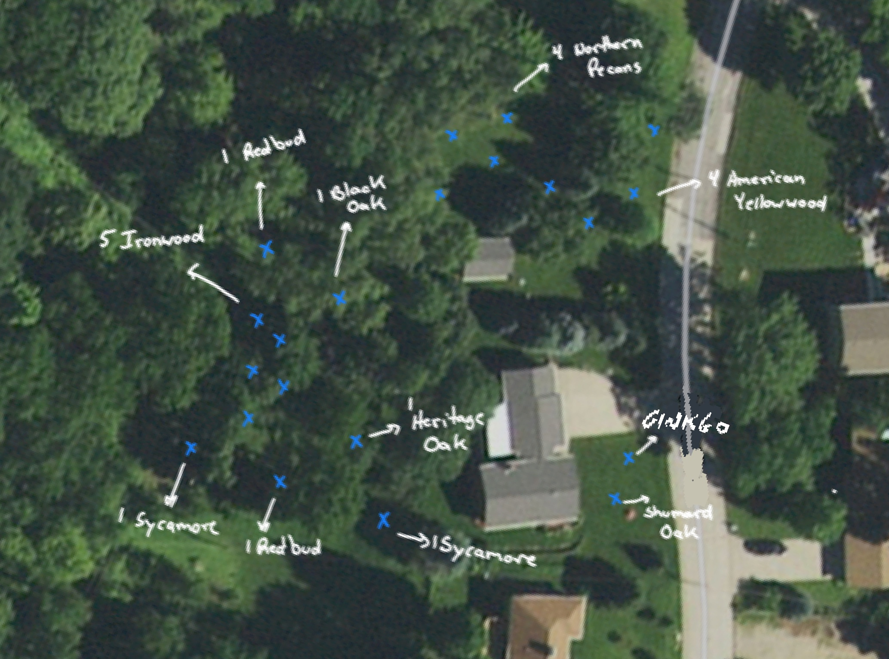

I'm sad for "my" trees.

Note to self: Before buying land "in the woods," pay attention to where
overhead power lines are. Because every 10 years or so the power company
comes along to trim tree limbs away from threatening those lines. 

And all your tree friends along those lines... It's sudden and traumatic violence. 

Had I been more aware, I could have spent the last 4 years plotting to bury those power lines? 

Now it's too late. For those trees. I hope they survive.

The challenge now before me: Bury those lines so the 20 trees I've
planted so far don't suffer a similar fate 20, 40, 60 years from now?

I'll be dead, but hopefully some of these trees will still be here?

## 2021 Planting

My arborist said these are all native species to this area, so this was the planting plan:

* 4 Northern Pecan
* 4 American Yellowwood
* 1 Ginkgo (not native, in honor of my grandmother)
* 1 Shumard Oak
* 2 Sycamore
* 1 Heritage Oak
* 2 Eastern Redbud
* 5 Ironwood
* 1 Black Oak

Planting: $2K.
Plus thousands to clear dying trees so they don't fall and crush "my" babies.
Plus thousands, over years, to try to keep
[emerald ash borer](https://en.wikipedia.org/wiki/Emerald_ash_borer) at bay.
We're not planting more of those, but they're huge and gorgeous and we're trying
to keep them that way as long as possible.
